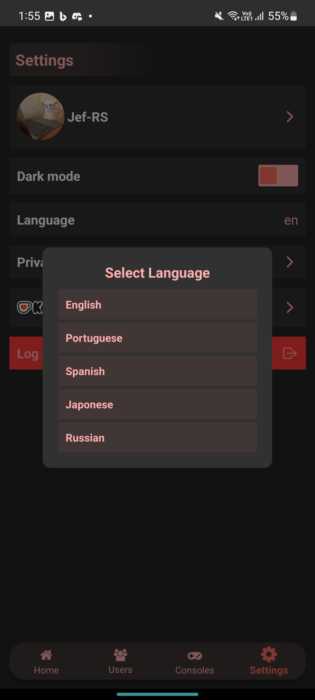

  

<h1 align="center">
  Retro Achieve+
</h1>

**Retro Achieve+** is an app designed to track your achievements and progress in retro games using the [Retro Achievements](https://retroachievements.org/) API. It offers a user-friendly and modern interface to explore your favorite games and monitor your performance.

## 📋 Features

- 🎮 **Recently Played Games**: View recently played games and their achievements.
- 🏆 **Achievement Progress**: Check detailed progress for your games.
- 🔍 **Game Search**: Explore games and get complete descriptions and information.
- 📊 **Top 10 Ranking**: See the top-performing players in achievements.
- ⭐ **Favorites**: Add other users to your favorites list to track their progress.
- 🔎 **Filter Achievements**: Filter types of achievements for easier navigation.
- 🎨 **Fluid Interface**: Optimized design for an intuitive and modern experience.

<h2 align="center">
  📷 Screenshots
</h2>

  
  
  
  

  Here are some key screenshots of the app. You can view more screenshots <a href="assets/screenshots">[here]</a>.

## 📥 Download Retro Achieve

**Retro Achieve** is now available on the Google Play Store!

## ☕ Support the Project

If you enjoy **Retro Achieve+** and want to support its continuous development, consider making a donation. Every contribution helps improve the app and keep the project alive! ❤️

## 📜 License

Retro Achieve+ is a private project. All rights reserved. No modification or commercial use is allowed without explicit authorization.
