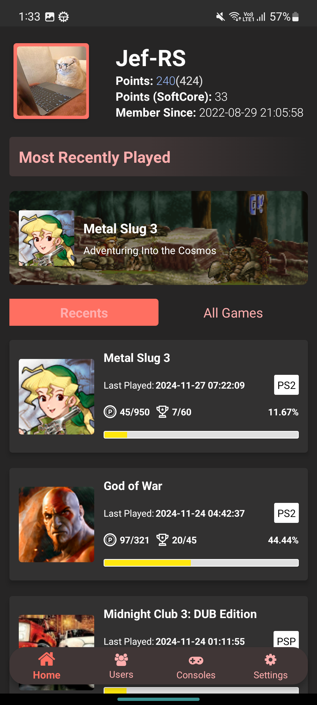
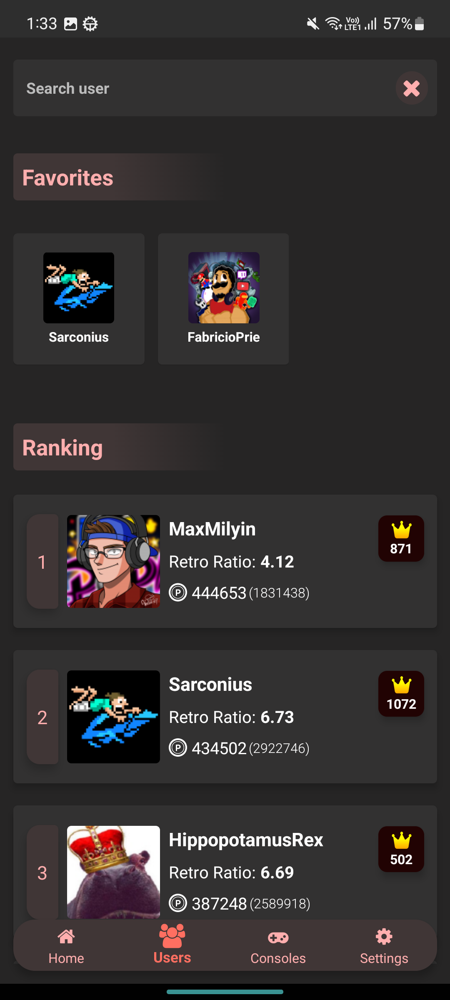
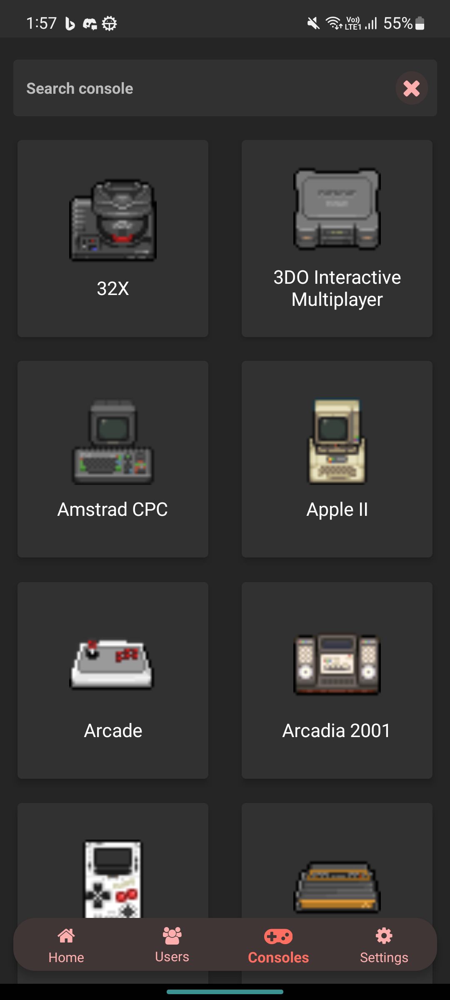
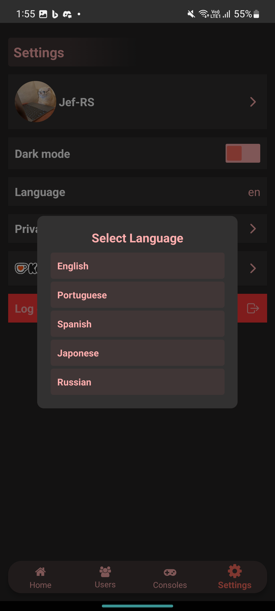

  

<h1 align="center">
  Retro Achieve+
</h1>

**Retro Achieve+** é um aplicativo desenvolvido para acompanhar suas conquistas e progresso em jogos retro utilizando a API do [Retro Achievements](https://retroachievements.org/). Ele oferece uma interface amigável e moderna para explorar seus jogos favoritos e monitorar seu desempenho.

## 📋 Funcionalidades

- 🎮 **Jogos Recentemente Jogados**: Veja os jogos jogados recentemente e suas conquistas.
- 🏆 **Progresso de Conquistas**: Confira o progresso detalhado nos seus jogos.
- 🔍 **Busca de Jogos**: Explore jogos e obtenha descrições e informações completas.
- 📊 **Ranking Top 10**: Veja os jogadores com melhor desempenho nas conquistas.
- ⭐ **Favoritos**: Adicione outros usuários à sua lista de favoritos para acompanhar seu progresso.
- 🔎 **Filtrar Conquistas**: Filtre os tipos de conquistas para facilitar a navegação.
- 🎨 **Interface Fluida**: Design otimizado para oferecer uma experiência intuitiva e moderna.

<h2 align="center">
  📷 Capturas de Tela
</h2>

  
  
  
  

  Aqui estão algumas capturas de tela chave do aplicativo. Você pode ver mais capturas de tela <a href="../assets/screenshots">[aqui]</a>.

## 📥 Baixe o Retro Achieve

O **Retro Achieve** já está disponível na Google Play Store!

## ☕ Apoie o Projeto

Se você gosta do **Retro Achieve+** e deseja apoiar o desenvolvimento contínuo, considere fazer uma doação. Cada contribuição ajuda a melhorar o aplicativo e manter o projeto ativo! ❤️

## 📜 Licença

Retro Achieve+ é um projeto privado. Todos os direitos reservados. Nenhuma modificação ou uso comercial é permitido sem autorização explícita.
